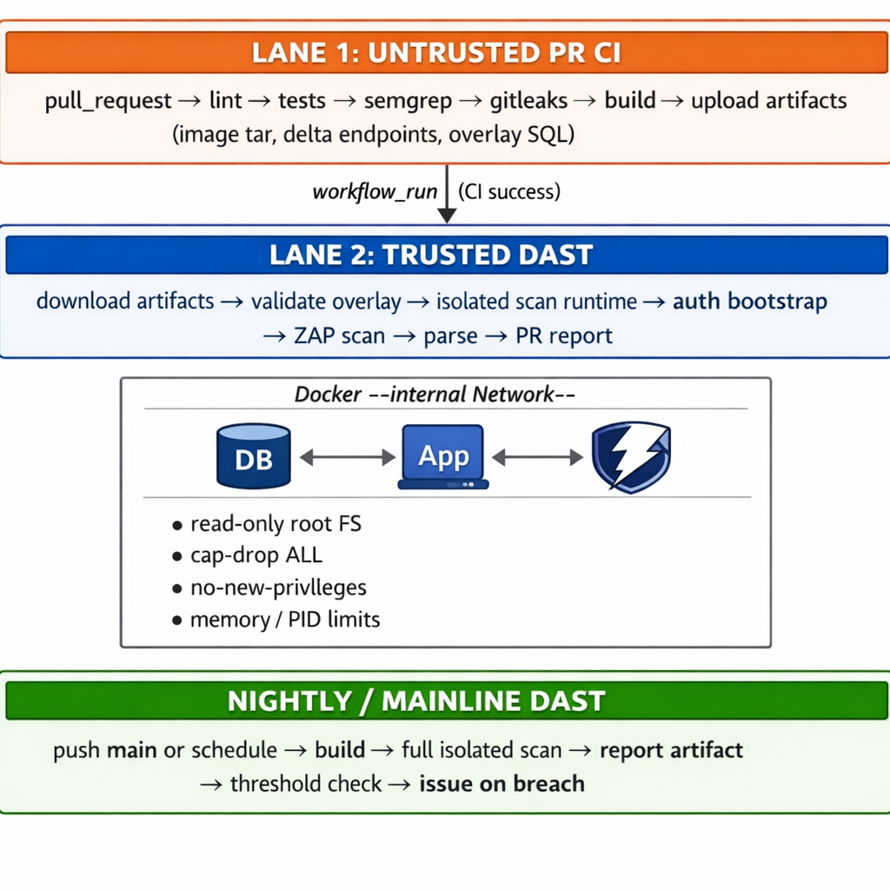

<p align="center">
  <h1 align="center">⚡ ZeroDAST</h1>
  <p align="center">
    <strong>Enterprise-grade CI DAST for open-source repositories. Zero cost. Zero vendor lock-in.</strong>
  </p>
  <p align="center">
    <a href="https://github.com/AlphaSudo/zerodast/actions"></a>
    <a href="https://github.com/AlphaSudo/zerodast/actions"></a>
    <a href="LICENSE"></a>
    
    
  </p>
</p>

---

> **ZeroDAST is an alpha CI-first DAST orchestration framework for REST APIs. The V2 release scope is a shared surgical scanner image plus optional per-target scan profiles. As of April 17, 2026 that shared surgical path preserves the Medium+ parity gate on `demo-core`, `NocoDB`, `Strapi`, `Directus`, and `Medusa`, with both local and hosted benchmark evidence captured in-repo.**

## V2 Status

- Release scope: **shared surgical image + optional scan profiles**, not dynamic per-target scanner image generation.
- V2 interfaces now exist in-repo: `ZAP_IMAGE`, `SCAN_PROFILE`, `CAPTURE_ZAP_INTERNALS`, and `CAPTURE_MEMORY`.
- Existing GitHub workflows still default to stock ZAP with no profile; enabling V2 behavior is explicit.
- V2 currently uses one shared surgical scanner image across targets; it does not yet generate a different scanner image per target.
- The rebuilt surgical image is now measured at `1.01 GB` versus `2.23 GB` for `zaproxy/zap-stable:2.17.0`.
- Medium+ parity now passes on the validated target set: `demo-core`, `NocoDB`, `Strapi`, `Directus`, and `Medusa`.
- That parity restoration came from two concrete fixes:
  - exposing `firefox` in the surgical image so ZAP's DOM XSS rule can execute the same browser-backed path as stock
  - removing add-on self-upgrades and realigning the image to the stock `2.17.0` add-on set
- Hosted benchmark evidence now exists for both:
  - stock vs surgical on `NocoDB`, `Strapi`, `Directus`, and `Medusa`
  - profiled vs unprofiled surgical on `NocoDB`, `Strapi`, `Directus`, and `Medusa`
- `CAPTURE_ZAP_INTERNALS` currently records installed addon inventory from the scan image, not a live loaded-class inventory.
- `NocoDB` still shows acceptable Medium+ detail drift in some comparisons; there are no missing Medium+ alert types in the validated passes.
- See [docs/V2_BENCHMARK_SUMMARY.md](docs/V2_BENCHMARK_SUMMARY.md) for the measured demo-core before/after benchmark.
- See [docs/V2_EXTERNAL_TARGET_BENCHMARKS.md](docs/V2_EXTERNAL_TARGET_BENCHMARKS.md) for local and hosted benchmark evidence across the four external validation targets.
- See [docs/V2_SHIP_STATUS.md](docs/V2_SHIP_STATUS.md) for the exact commands, measured outputs, and release caveats.

---

## 📋 Table of Contents

- [What is ZeroDAST?](#-what-is-zerodast)
- [Why ZeroDAST Over Vanilla ZAP?](#-why-zerodast-over-vanilla-zap)
- [Key Numbers](#-key-numbers)
- [Architecture](#-architecture)
- [Comparison: ZeroDAST vs Vanilla ZAP vs Enterprise DAST](#-comparison-zerodast-vs-vanilla-zap-vs-enterprise-dast)
- [Benchmark Evidence](#-benchmark-evidence)
- [Getting Started](#-getting-started)
- [How It Works](#-how-it-works)
- [Proven External Targets](#-proven-external-targets)
- [What ZeroDAST Does Not Do (Yet)](#-what-zerodast-does-not-do-yet)
- [Documentation](#-documentation)
- [Security](#-security)
- [Contributing](#-contributing)
- [License](#-license)

---

## 🔍 What is ZeroDAST?

**ZeroDAST** is an open-source, CI-first **Dynamic Application Security Testing (DAST)** orchestration framework purpose-built for public GitHub repositories with documented REST APIs.

It wraps [OWASP ZAP](https://www.zaproxy.org/) inside a **security-hardened, privilege-isolated CI pipeline** that delivers enterprise-grade scanning capabilities — trusted/untrusted workflow separation, authenticated multi-role scanning, delta-scoped PR analysis, baseline-aware triage, and structured operator artifacts — all without a single dollar of licensing cost.

### What it does in plain terms

1. **Scans your API** — automatically discovers and tests your REST endpoints for vulnerabilities (SQLi, XSS, IDOR, misconfigurations)
2. **Runs in your CI** — PR scans in ~3 minutes, nightly full scans in ~5 minutes, all inside GitHub Actions
3. **Handles auth for you** — auto-bootstraps user and admin tokens across 4 proven auth styles
4. **Isolates everything** — your app, database, and scanner run inside a hardened, network-isolated container environment
5. **Reports intelligently** — diff-aware baseline comparison, remediation guidance, API route coverage inventory, and PR bot comments
6. **Costs nothing** — open-source, no SaaS, no per-developer fees

### Who is it for?

| ✅ Great Fit | ⚠️ Not Yet Supported |
|---|---|
| OSS maintainers wanting CI DAST | SSO / SAML / OIDC / MFA auth flows |
| Small/medium REST API projects | GraphQL / SOAP / gRPC protocols |
| Token-bootstrap-friendly APIs | Large enterprise governance programs |
| OpenAPI-documented services | Shadow API discovery from live traffic |
| Teams tired of noisy, expensive scanners | Browser-recorded login flows |

---

## 🚀 Why ZeroDAST Over Vanilla ZAP?

Running `docker run zaproxy/zap-stable` against your API is easy — but it's also **unauthenticated, unstructured, and often useless for real API testing**. Here's why:

### The Auth Problem

On **4 real-world open-source targets** (NocoDB, Strapi, Directus, Medusa), vanilla ZAP discovered **0 API endpoints** across all four. ZeroDAST discovered **48**. The difference? **Authentication.**

Vanilla ZAP can't handle non-standard headers (`xc-auth`), nested token fields (`data.token`, `data.access_token`), or admin-vs-user API separation without per-target custom scripting. ZeroDAST's adapter framework handles all of this through config — zero code changes.

### The Signal Problem

| Metric | Vanilla ZAP | ZeroDAST | Difference |
|---|---|---|---|
| Fleet total findings (4 targets) | 77 | **117** | **+52%** |
| Fleet API URIs reached | **0** | **48** | **∞ improvement** |
| NocoDB findings | 30 (0 API) | **34 (7 API)** | +13%, superset |
| Strapi findings | 14 (0 API) | **26 (8 API)** | +86%, superset |
| Directus findings | 28 (0 API) | **51 (30 API)** | +82%, superset |
| FastAPI (T4) | **0** — scan failed entirely | **14 API alert URIs** | Vanilla can't scan this target at all |

> **ZeroDAST is a strict superset of vanilla ZAP** — it finds everything vanilla finds (frontend/static) **plus** all authenticated API findings.

### The Isolation Problem

| Security Control | Vanilla ZAP | ZeroDAST |
|---|---|---|
| Trusted/untrusted workflow split | ❌ | ✅ |
| Artifact handoff (no direct trust reuse) | ❌ | ✅ |
| Container hardening (`cap-drop`, `no-new-privileges`, read-only root) | ❌ | ✅ |
| `--internal` network isolation | ❌ | ✅ |
| Memory & PID limits | ❌ | ✅ |
| Overlay SQL validation | ❌ | ✅ |

### The Operator Problem

| After the Scan | Vanilla ZAP | ZeroDAST |
|---|---|---|
| Report format | JSON + HTML (raw) | JSON + HTML + environment manifest + result state + remediation guide + operational reliability + API inventory |
| Baseline comparison | ❌ None | ✅ Diff-aware new/persisting/resolved |
| Triage guidance | ❌ Raw report, figure it out | ✅ Structured remediation guide with priority ordering |
| PR bot comments | ❌ Manual wiring | ✅ Automated with policy modes (`always` / `actionable` / `new_findings`) |
| Nightly issue management | ❌ None | ✅ Deduplicated triage issues with operator context |
| API route coverage | ❌ None | ✅ Observed/unobserved/hinted route inventory |
| Fleet tracking | ❌ None | ✅ Lightweight multi-target registry |

---

## 📊 Key Numbers

<table>
<tr>
<td align="center"><strong>~3 min</strong><br>PR scan time</td>
<td align="center"><strong>~5 min</strong><br>Nightly scan time</td>
<td align="center"><strong>$0</strong><br>Total cost</td>
<td align="center"><strong>7</strong><br>External targets proven</td>
</tr>
<tr>
<td align="center"><strong>3</strong><br>Language stacks (Java, Python, Node.js)</td>
<td align="center"><strong>4</strong><br>Auth styles proven</td>
<td align="center"><strong>52%</strong><br>More findings vs vanilla ZAP</td>
<td align="center"><strong>48</strong><br>API URIs vs 0 (vanilla)</td>
</tr>
<tr>
<td align="center"><strong>4/4</strong><br>Model 1 fleet CI-green</td>
<td align="center"><strong>100k+</strong><br>Combined GitHub stars (proven targets)</td>
<td align="center"><strong>17/17</strong><br>Petclinic routes covered</td>
<td align="center"><strong>0</strong><br>Vendor lock-in</td>
</tr>
</table>

---

## 🏗 Architecture

ZeroDAST uses a **two-lane privilege-isolated CI architecture** that separates untrusted PR code execution from trusted DAST scanning:

<p align="center">
  
</p>

### Three-Layer Defense Model

| Layer | What It Does |
|---|---|
| **Privilege Isolation** | PR code runs with read-only permissions; DAST runs from trusted `main` via `workflow_run` on a separate runner |
| **Credential & Artifact Isolation** | PR builds a Docker image uploaded as an artifact; DAST downloads it — no direct runtime trust reuse |
| **Network Isolation** | App, DB, and ZAP communicate on a Docker `--internal` network; the GitHub runner stays outside |

---

## ⚔️ Comparison: ZeroDAST vs Vanilla ZAP vs Enterprise DAST

### Capability Matrix

| Capability | No DAST | Vanilla ZAP | ZeroDAST | Enterprise DAST (e.g. Checkmarx) |
|---|---|---|---|---|
| **Cost** | $0 | $0 | **$0** | $180k–$350k/yr (50–100 devs) |
| **CI timing** | — | Varies (8m+ on demo app) | **~3 min PR, ~5 min nightly** | 15–60 min typical |
| **Auth handling** | — | Manual per-target scripting | **Adapter framework: 4 proven styles** | Browser recording, SSO/SAML/OIDC/MFA |
| **Trusted/untrusted split** | — | ❌ | **✅** | Platform-managed |
| **Container hardening** | — | ❌ | **✅ (read-only, cap-drop, no-new-privileges)** | Varies |
| **Delta PR scanning** | — | ❌ | **✅ Route-aware git-diff scoping** | Incremental varies |
| **Baseline comparison** | — | ❌ | **✅ Diff-aware new/persisting/resolved** | ✅ Platform-managed |
| **Remediation guide** | — | ❌ | **✅ Structured priority ordering** | ✅ Platform-managed |
| **API inventory** | — | ❌ | **✅ Observed/unobserved/hinted routes** | ✅ Proprietary metrics |
| **PR bot comments** | — | Manual wiring | **✅ Policy-driven** | ✅ Platform-managed |
| **Fleet tracking** | — | ❌ | **✅ Lightweight file-based** | ✅ Full portfolio model |
| **Vendor lock-in** | — | None | **None** | Yes |
| **Transparency** | — | Open | **Fully inspectable** | Proprietary black box |

### Where Enterprise DAST Is Still Stronger

- **Auth breadth**: SSO/SAML/OIDC/MFA/browser recording (outside ZeroDAST's target niche)
- **Protocol breadth**: GraphQL, SOAP, gRPC support (outside the niche)
- **Finding depth**: Proprietary detection rules beyond ZAP's standard rule set
- **Platform features**: Full governance/compliance/RBAC/ASPM
- **Commercial support**: SLAs, dedicated support teams

### Where ZeroDAST Is Stronger Than Both

- **CI speed**: PR scans ~3 min vs 15–60 min enterprise, vs 8+ min vanilla
- **Trust architecture**: Genuine privilege isolation that vanilla ZAP lacks and enterprise handles differently
- **Transparency**: Every script, config, and decision is inspectable — not a black box
- **Cost**: Free vs $180k+/year
- **Repo coupling**: Zero files added to the target repo (Model 2 external orchestrator)

---

## 📈 Benchmark Evidence

> Full benchmark data, methodology, and CI proof links → [NEAR_LOSSLESS_COMPARISON.md](docs/NEAR_LOSSLESS_COMPARISON.md)  
> Benchmark protocol → [BENCHMARK_PROTOCOL.md](docs/BENCHMARK_PROTOCOL.md)

### Summarized Fleet Results (All Measured in CI)

All tests ran on the same GitHub-hosted runners, same ZAP `2.17.0`, same Docker Compose targets. The only difference: ZeroDAST adds auth, seeding, and isolation.

| Target | ⭐ Stars | Vanilla ZAP | ZeroDAST | Signal Lift |
|---|---:|---|---|---|
| **NocoDB** | 48k+ | 8M/15L/7I — **0 API** URIs | 11M/15L/8I — **7 API** URIs | +13% findings, superset |
| **Strapi** | 67k+ | 3M/7L/4I — **0 API** URIs | 8M/10L/8I — **8 API** URIs | +86% findings, superset |
| **Directus** | 29k+ | 10M/10L/8I — **0 API** URIs | 13M/12L/26I — **30 API** URIs | +82% findings, superset |
| **Medusa** | 27k+ | 2M/3L/0I — **0 API** URIs | 4M/2L/0I — **3 API** URIs | Superset |
| **Demo App** | — | 11 alerts, auth **failed** — 8m 44s | Same + auth success + admin — 2m 53s | Faster + more coverage |
| **FastAPI** | — | **0 findings** — scan failed entirely | 14 API alert URIs — 3m 44s | ∞ (vanilla can't scan) |
| **Petclinic** | — | T5: 43 URIs (noisier, conventional trust) | 17/17 routes, cleaner isolation | Cleaner trust posture |
| **Fleet Total** | **100k+** | **77 findings, 0 API URIs** | **117 findings, 48 API URIs** | **+52% findings** |

### CI Proof Links

Every claim is backed by a green GitHub Actions run:

| Target | Proof |
|---|---|
| NocoDB Model 1 | [AlphaSudo/nocodb `zerodast-install`](https://github.com/AlphaSudo/nocodb/tree/zerodast-install) |
| Strapi Model 1 | [AlphaSudo/strapi `zerodast-install`](https://github.com/AlphaSudo/strapi/tree/zerodast-install) |
| Directus Model 1 | [AlphaSudo/directus `zerodast-install`](https://github.com/AlphaSudo/directus/tree/zerodast-install) |
| Medusa Model 1 | [AlphaSudo/medusa `zerodast-install`](https://github.com/AlphaSudo/medusa/tree/zerodast-install) |
| Petclinic T4 | [petclinic-t4-scan.yml](https://github.com/AlphaSudo/zerodast/actions/workflows/petclinic-t4-scan.yml) |
| FastAPI T4 | [fullstack-fastapi-t4-scan.yml](https://github.com/AlphaSudo/zerodast/actions/workflows/fullstack-fastapi-t4-scan.yml) |
| Core Demo Nightly | [dast-nightly.yml](https://github.com/AlphaSudo/zerodast/actions/workflows/dast-nightly.yml) |

---

## 🚀 Getting Started

### Prerequisites

| Tool | Minimum Version |
|---|---|
| Docker (or Podman) | Latest stable |
| Node.js | 22+ |
| Python | 3.11+ |
| Git Bash (Windows) | Latest |

### Option 1: Run the Built-in Demo (Fastest)

```bash
# Clone the repo
git clone https://github.com/AlphaSudo/zerodast.git
cd zerodast

# Install demo app dependencies
cd demo-app && npm install && cd ..

# Run local DAST scan
chmod +x scripts/run-dast-local.sh
./scripts/run-dast-local.sh
```

### Option 2: Install Model 1 into Your Repo (~30 min setup)

Model 1 adds exactly **two zones** to your repository:
- `.github/workflows/zerodast-pr.yml` + `zerodast-nightly.yml`
- `zerodast/` (config, scan runner, verification scripts)

```powershell
# From the ZeroDAST repo root
./prototypes/model1-template/install.ps1 -TargetRepoPath 'C:\path\to\your-repo'
```

Then configure `zerodast/config.json` with your target's:
- Health endpoint
- OpenAPI endpoint
- Auth credentials and adapter type
- Request seeds for key routes

```bash
# Run locally
chmod +x zerodast/run-scan.sh
ZERODAST_MODE=pr ./zerodast/run-scan.sh
```

> 📖 Full install guide → [MODEL1_INSTALL_GUIDE.md](docs/MODEL1_INSTALL_GUIDE.md)

### Option 3: AI-Guided Setup

Use the built-in prompt templates to adapt ZeroDAST to any target:

1. Run `ai-prompts/INSPECT_REPO.md` against your target
2. Feed output into `ai-prompts/GENERATE_CONFIG.md`
3. Refine auth with `ai-prompts/ADAPT_AUTH.md`
4. Refine data seeding with `ai-prompts/ADAPT_SEED.md`
5. Use `ai-prompts/AI_TRIAGE.md` after scans for fix guidance

### Uninstall

```powershell
./prototypes/model1-template/uninstall.ps1 -TargetRepoPath 'C:\path\to\your-repo'
```

Clean removal — only the `zerodast/` folder and two workflow files.

---

## ⚙️ How It Works

### Two-Profile CI DAST

| Profile | Trigger | Scope | Typical Time |
|---|---|---|---|
| **PR / Delta** | `workflow_run` after PR CI passes | Changed routes only (git-diff scoped) | ~3 min |
| **Nightly / Full** | `schedule` or `push main` | Full API surface | ~5 min |

### Auth Adapter Framework

ZeroDAST auto-bootstraps authentication through pluggable adapters:

| Adapter | Auth Style | Proven On |
|---|---|---|
| `json-token-login` | JSON body → Bearer token | Demo app, Petclinic, NocoDB, Directus, Medusa |
| `form-cookie-login` | Form POST → session cookie | Demo app |
| `json-session-login` | JSON body → session header | Django Styleguide |
| `form-urlencoded-token-login` | OAuth2-style form → Bearer token | FastAPI |

**Custom header support**: configure `headerName` in `config.json` for non-standard headers (e.g., NocoDB's `xc-auth`).  
**Nested token extraction**: use dot-path notation like `data.token` or `data.access_token` — zero custom scripting needed.

### Delta Detection Pipeline

```
PR opens → git diff --name-only → route extraction from changed files
    ├── routes changed → scoped ZAP config (includePaths + targeted seeds)
    └── core/middleware changed → escalate to FULL scan
```

### Report Artifacts

Every scan produces:

| Artifact | Purpose |
|---|---|
| `zap-report.json` / `.html` | Raw ZAP findings |
| `environment-manifest.json` | Scanned environment context |
| `result-state.json` | Baseline-adjusted triage state (`clean` / `baseline_only` / `needs_triage`) |
| `remediation-guide.md` | Prioritized fix guidance (new → persisting → resolved) |
| `operational-reliability.json` | Runtime health (`healthy` / `degraded` / `failed`) |
| `api-inventory.json` / `.md` | Route coverage: observed, unobserved, hinted, undocumented |

---

## 🌍 Proven External Targets

ZeroDAST has been proven on **7 external targets** across **3 language stacks**:

| Target | Stack | Stars | Auth Style | Runtime | Model |
|---|---|---:|---|---|---|
| [NocoDB](https://github.com/AlphaSudo/nocodb/tree/zerodast-install) | Node.js | 48k+ | `xc-auth` custom header | 242s | Model 1 in-repo |
| [Strapi](https://github.com/AlphaSudo/strapi/tree/zerodast-install) | Node.js | 67k+ | Bearer JWT (nested `data.token`) | 171s | Model 1 in-repo |
| [Directus](https://github.com/AlphaSudo/directus/tree/zerodast-install) | Node.js | 29k+ | Bearer JWT (nested `data.access_token`) | 343s | Model 1 in-repo |
| [Medusa](https://github.com/AlphaSudo/medusa/tree/zerodast-install) | Node.js | 27k+ | Bearer JWT | 108s (ZAP) | Model 1 in-repo |
| [Petclinic](https://github.com/spring-petclinic/spring-petclinic-rest) | Java/Spring | — | Public REST | 309s | T4 external |
| [FastAPI Template](https://github.com/fastapi/full-stack-fastapi-template) | Python/FastAPI | — | OAuth2 Bearer | 225s | T4 external |
| [Django Styleguide](https://github.com/HackSoftware/Django-Styleguide-Example) | Python/Django | — | Session header | 92s | Auth profile |

---

## ❌ What ZeroDAST Does Not Do (Yet)

We believe in honest claims. Here's what is **not** currently supported:

- **Enterprise auth**: SSO / SAML / OIDC / MFA / browser-recorded login flows
- **Non-REST protocols**: GraphQL, SOAP, gRPC scanning
- **Shadow API discovery**: No production traffic analysis
- **Platform features**: No governance / compliance / RBAC / ASPM control plane
- **Universal coverage**: Results are target-dependent, not universal across arbitrary stacks
- **Commercial support**: Community-only, no SLA

> For a full capabilities inventory → [CURRENT_CAPABILITIES.md](docs/CURRENT_CAPABILITIES.md)  
> For honest claim assessment → [CLAIM_READINESS.md](docs/CLAIM_READINESS.md)

---

## 📚 Documentation

### Project site (canonical landing & SEO)

| Resource | Description |
|---|---|
| [alphasudo.github.io/zerodast](https://alphasudo.github.io/zerodast/) | Single-page site: meta tags, sitemap, and Search Console–friendly canonical URL |

### Core

| Document | Description |
|---|---|
| [ARCHITECTURE.md](docs/ARCHITECTURE.md) | Three-layer defense model and data flow |
| [CURRENT_CAPABILITIES.md](docs/CURRENT_CAPABILITIES.md) | Complete current-state capability inventory |
| [QUICK_START.md](docs/QUICK_START.md) | Local setup and adaptation workflow |
| [THREAT_MODEL.md](docs/THREAT_MODEL.md) | Attack vectors and mitigations |

### Benchmarks & Evidence

| Document | Description |
|---|---|
| [NEAR_LOSSLESS_COMPARISON.md](docs/NEAR_LOSSLESS_COMPARISON.md) | **Full comparison**: ZeroDAST vs Vanilla ZAP vs Enterprise DAST across all targets |
| [BENCHMARK_COMPARISON.md](docs/BENCHMARK_COMPARISON.md) | T1–T5 tier-by-tier analysis |
| [BENCHMARK_PROTOCOL.md](docs/BENCHMARK_PROTOCOL.md) | Benchmark methodology and execution rules |
| [CLAIM_READINESS.md](docs/CLAIM_READINESS.md) | Phase 6 readiness assessment |

### Model 1 (In-Repo Adoption)

| Document | Description |
|---|---|
| [MODEL1_INSTALL_GUIDE.md](docs/MODEL1_INSTALL_GUIDE.md) | Step-by-step installation into your repo |
| [MODEL1_PROTOTYPE_DESIGN.md](docs/MODEL1_PROTOTYPE_DESIGN.md) | Prototype architecture and design rationale |
| [MODEL1_ADOPTION_KIT.md](docs/MODEL1_ADOPTION_KIT.md) | Adoption kit for evaluators |

### Operational

| Document | Description |
|---|---|
| [FLEET_SUMMARY.md](docs/FLEET_SUMMARY.md) | Multi-target fleet status |
| [ALPHA_RELEASE_NOTES.md](docs/ALPHA_RELEASE_NOTES.md) | Current alpha status and proven outcomes |
| [SECURITY.md](SECURITY.md) | Security policy and reporting |

---

## 🔒 Security

The demo application is **intentionally vulnerable** — it contains SQLi, XSS, IDOR, and application error disclosure surfaces by design. **Never deploy it to production or expose it to the public internet.**

To report a security issue in ZeroDAST itself, see [SECURITY.md](SECURITY.md).

---

## 🤝 Contributing

See [CONTRIBUTING.md](CONTRIBUTING.md) for the full contribution guide (prerequisites, running tests, overlay validation, and PR checklist).

For security-sensitive changes, also read [CONTRIBUTING_SECURITY.md](docs/CONTRIBUTING_SECURITY.md).

---

## 📄 License

Apache License 2.0 — see [LICENSE](LICENSE).

---

<p align="center">
  <sub>Built with discipline. Proven with evidence. Licensed for freedom.</sub>
</p>
